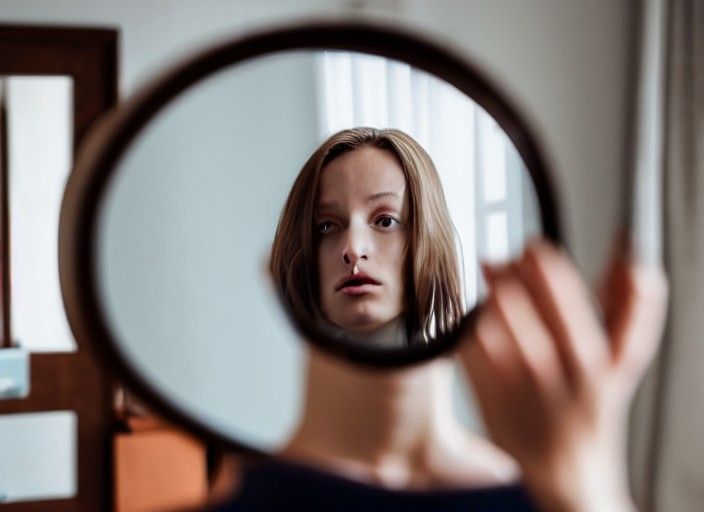

### Journal 8/15/2021
One of the biggest issues with KHD syndrome, at least in day-to-day life, is the joint pain. Nothing’s better than stepping off the sidewalk in flip-flops onto asphalt at approximately one degree past your normal ankle rotation, only for your ankle to decide that today’s the day it’s going to give up, turning your awkward step into a ninety-degree twist and tumble onto the ground. Then, there’s the month in a boot, being unable to keep up with your friends and coworkers as they walk around the job site, and after you get the boot off, with the stiffened joint and unresponsive foot, walking like Frankenstein – Frankenstein’s monster if you’re a purist – for days to weeks.

However, there are some newer symptoms that are giving me pause. Do you ever have that feeling, when you look in the mirror, that the person looking back isn’t quite you? Your jaw is slightly too big – too angular really – and it seems to look different by the day; your face is too long in the way that elderly people’s faces seem to flow down their skull; you’re too big; your hands are larger. It’s not real, right? After all, it’s not like my hands are actually changing size – I can pick up a can of PBR just the same as I did a month ago – but it feels as if that’s the case. It just feels wrong though. My hair is falling out too, and I can’t stop noticing it. Hair loss is one of those things – after all, my grandfather went bald at twenty-five – but also, I’m a little too young for that, and whether it’s all in my head, or I’ve just started noticing it, or of medical pathology, I just can’t stop noticing it in the mirror.

This isn’t the actual case though. People don’t notice these things; no one’s commented on how disproportionately large my hands are recently, or that my face looks different. But I live in my own body, and I see these daily changes; it can be hard to even look at myself for an extended period – it’s like my gaze slides off myself when I try to focus on my body? Anyway, I’ll mention this next time I’m at the doctor’s office.

### Journal 8/30/2021
I’ve been on that new medicine, doxcolimab, if that’s the right spelling – there’s so many consonants in pharma names that it’s hard to keep them straight (who can even tell the difference between Zofran and Zyrtec?). I think it’s working? I mean, my hands still seem disproportionate, and I could not recognize my own face out of a police lineup, but I can’t bring myself to care about it. Every time I start to work myself into a panic about these things, about my body feeling too big, and so on, it calms me down. I can’t quite reach the level of a panic attack. Which is good. I still don’t want to look at myself? But I don’t really need to in the first place. The doctor, or nurse practitioner, they’re cheaper to go to and my health insurance could be much better than it is, told me that it could blunt other emotions too, but I don’t really see that. I can still feel happy, sad, angry, and the magnitude of those emotions isn’t really a big deal, after all, they’re still there.

### Journal 1/1/2022
I’m a little hungover from Henry’s NYE party. Forgot to bring my medicine over to the Ozarks, but I was only going to be here ‘till tomorrow, so I didn’t think it was a huge deal, not taking meds for a few days shouldn’t hurt too bad, especially since it takes a few weeks to kick in anyway. Kinda regret it now though. I started caring about these things again, and I think other people are noticing them. People treat me differently; they think I can carry things easier, that I look older, that would be caused by how I’m seeing myself. This medicine was all about perception – why are people noticing? I don’t even recognize myself in the mirror. My forehead’s too big, and my hair – my hair’s fallen out a lot. I didn’t care about it before because I was taking doxcolimab, but now I can’t stop noticing it. Why hasn’t anyone else? I’m just going through the motions ‘till I get back home, stopping and thinking about this is difficult with everyone around me.

**this is a work of fiction lol**
