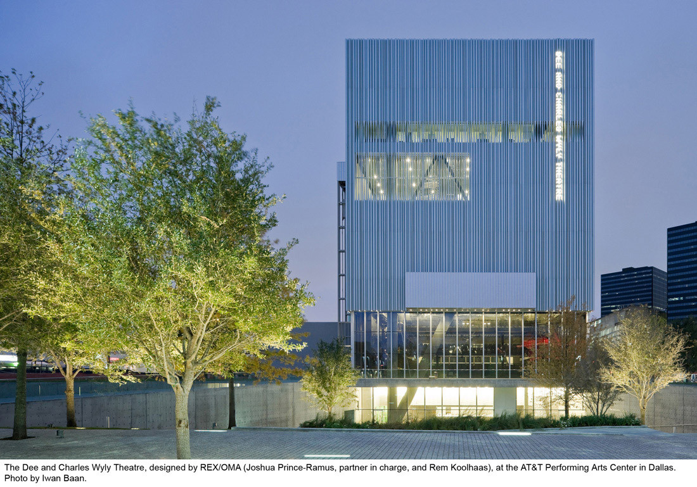
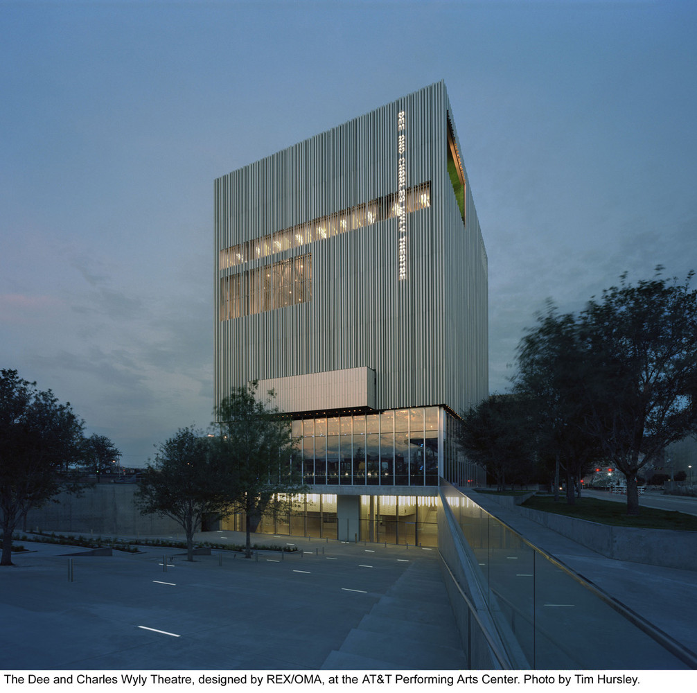

# Dee and Charles Wyly Theater
## 2400 Flora Street, Dallas, TX, 75201 | Arts District
## Designed by Joshua Prince-Ramus and Rem Koolhaas (OMA | REX)
### Construction 2006-2009

***

## Purpose, Function, Users

This building was created as a new theater and arts center for Dallas, TX, meant to be a new kind of theater; more modular, more adaptable, and more functional. It was meant to be a "populist" building, where the audience could feel as participants. The building is fully adaptable; seats can be added and removed, the stage can be changed, even the height of the ceiling can vary. The only constant is the upstairs conference room.

The main users of the structure are the theatergoers, actors and other members of the plays, and the AT&T Performing Arts Center's employees. Secondary users include janitorial, maintenance, and set design staff. 

***

## Image Gallery

***
## Commentary

<h4>Feeling/Impressions</h4>
The vertical lines of tubing crossing the building give a feeling of height and solidity, while the pressed-concrete stairs leading to the doors are cold and undecorated, but welcoming. In the context of the Dallas Arts District, the building is distinct. The nearby buildings are either steel-and-glass structures, the usual tower, or lower-to-the ground museums. This building seems to invert the idea of the steel-and-glass tower; with steel as the main outer shell. With all of these qualities, the building could be nothing else but a theater.

<!--comment 2-->

##### Materials: Glass, Steel Tubing, Reinforced Concrete

***

## Featured Books

In this piece, Karen Forbes interviews Joshua Prince-Ramus on his more prominent buildings: The Seattle Public Library, Wyly Theater, Caltech buildings, and Kortjik LLLibrary. They discuss the importance of location to architecture, the role of architecture in helping society, and considerations of construction. In terms of the Wyly Theater, he discusses his design principles for it, his favorite form of the the theater, and other highlights.

<blockquote align="right">Forbes, Karen, and Peter Zumthor. Site Specific: Conversations with Peter Zumthor, Steven Holl, Róisín Heneghan, Bjarne Mastenbroek, Bjarke Ingels, Joshua Prince-Ramus, Patrik Schumacher, Kjetil Thorsen, Craig Dykers, and Harry Gugger. , 2015. Print.</blockquote>

<!--book 2-->

***

## Drawing

***

## Interior

#### Modularity/Adaptability

What differentiates the Wyly Theater from most other structures is its ability to change to the needs of the user. Everything inside can be removed, the seats can be rearranged, the upper structure can be hollowed out, the stage's shape can change, all to the needs of the audience and stagehands.

***

## Surroundings

The building is in the urban, central business district of Downtown Dallas. It is dwarfed compared to the rest of Downtown's buildings, but in it's immediate area, it's one of the taller buildings, owing to the parking lots, schools, and smaller performance halls surrounding it. This makes the structure distinct in the area, and almost pulls people towards it to observe it.

***

## Interview with Evan

***

## My Experience

I visited the building for the first time for the 2015 Aurora Lights Festival, based in the Arts District at the time. I didn't go in, as the building itself was the installation. Hundreds of projectors shone across the building, changing its perceived form as blocks of the building seems to move, disappear, crumble away, ripple, and dance as the projectors created the illusion of movement. It was striking; an entire building being used as an art installation was like nothing I'd ever seen, and the memory is indelibly etched in my mind.

***

## Rem Koolhaas
### From <a href="https://www.curbed.com/2019/8/22/20755386/rem-koolhaas-smlxl-review-oma">curbed.com</a>

Koolhaas is something of a rockstar of the architectural world despite all his attempts to get away with it. He's one of the founders of the Office for Metropolitan Arhitecture, which has constricted buildings around the world. Personally, he is very outspoken against competitions, calling them a form of torture, as well as "overworking" oneself. All of this is detailed in his famous book, "S,M,L,XL", covering his work from 1972-1995.

***

## Wyly in the News
### From <a href="https://www.nytimes.com/2009/10/15/arts/design/15dallas.html">nytimes.com</a>

This article let me in on interpersonal politics that the majority of Dallas residents aren't aware of. First and foremost, Ramus was Koolhaas' employee up until the middle of this project, when Ramus suddenly quit and started his own studio, REX. Secondly, the original design of the building was going to be much more grand, with four central sliding doors that could open the stage and audience up to the street; this was later replaced with two pivoting doors. Finally, the building was meant to reinvigorate the Arts District (from personal experience, with little success). 

***

## Video

<iframe width="560" height="315" src="https://www.youtube.com/embed/SafGj_M89jk?controls=0" frameborder="0" allow="accelerometer; autoplay; encrypted-media; gyroscope; picture-in-picture" allowfullscreen></iframe>

This video demonstrates the modularity and shifting form of the building. In but a day, everything can change, and a user can experience the building in a novel way.

***
## Sources

* https://www.attpac.org/your-visit/venues/wyly-theatre/
* https://www.curbed.com/2019/8/22/20755386/rem-koolhaas-smlxl-review-oma
* https://searchworks.stanford.edu/view/11348020
* https://www.nytimes.com/2009/10/15/arts/design/15dallas.html
* https://www.archdaily.com/37736/dee-and-charles-wyly-theatre-rex-oma?ad_medium=gallery
* http://www.architectureweek.com/2010/1027/design_3-2.html