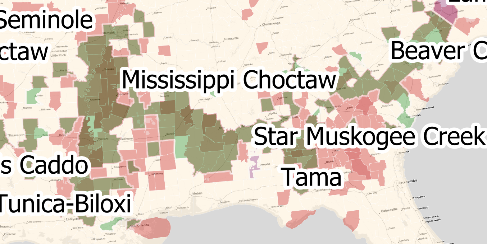
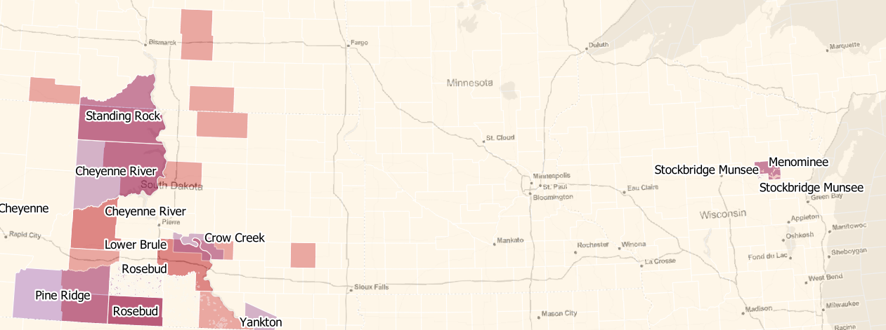

## IRS Audit Data

##### Ethan Helfman

ProPublica recently <a href="https://www.propublica.org/datastore/dataset/irs-audit-rates-by-county">released</a> IRS audit data by county. While looking through it, I noticed something alarming - nearly the entire Rio Grande Valley (RGV) stood out on the map. Then, looking over to Wisconsin, I noticed that only one county was highlighted - Menominee - which is a reservation. An unnerving pattern began to emerge, and I wanted to explore the data more.

According to the data I downloaded from ProPublica, the Mississippi Delta is the most highly-audited region in the nation, with many counties having an audit rate over twice the standard deviation of the country. In other words, they are in or above the 95th percentile in audits. The Delta also has some of the highest African-American population in the country. To test if this trend extended to the rest of the country, I downloaded the 2010 Census' race table by county and mapped every county with a Black population greater that 40% (This is shown in green on the map). Looking to the South, the Black Belt - a region delineated by the remmenants of former plantations constructed on fertile soil - is clearly visible. Alabama's portion of the Black Belt is particularly visible on the IRS map; the region and the IRS audit map have almost the same county boundaries.

Native American reservations are also very visible on this map, particularly in the Southwest and Midwest. Moving north, the Oglala, Menominee, Crow, and Standing Rock plantations each stand out. Standing Rock, with an extreme poverty rate of <a href="https://en.wikipedia.org/wiki/Reservation_poverty#Extreme_poverty_rates_on_the_ten_largest_reservations">16.6%</a>, leads to a question: why are the poorest areas of the country receiving the most audits? The Crow reservation, with a poverty rate of 9.6% and the Pine Ridge reservation, with a poverty rate of 20.9% add to this concern.

The Navajo and Hopi reservations stand out in the Southwest. Respectively, they have poverty rates of 14.9% and 31% - well above the national average. 

Finally, moving down to Texas, the RGV is clearly visible. A historically Hispanic area, the Rio Grande Valley has some of the highest poverty rates in the country, hovering around <a href="https://www.themonitor.com/2020/01/14/letters-poverty-rgv/">55%"</a>. Many towns in the area do not have <a href="https://quod.lib.umich.edu/m/mjs/12333712.0002.010?view=text;rgn=main">adequate sewage, sanitation, or basic services</a>. From all of the above data, one is led to wonder why the most impoverished areas in the nation are harmed the most by the IRS.

<iframe src="http://hjelfman.com/int_irs/index.html"></iframe>

Sources: ProPublica, Census
